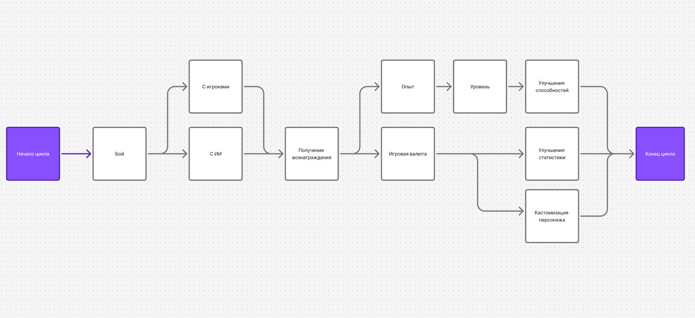

# Техническое задание на разработку игры

## 0. Шапка

Паршин Кирилл Александрович

ИТ11.24.2

ParshinKA23@spb.ithub.ru

жанр: симулятор
 
сеттинг: супергерои 

фишка: геолокация/камера

## 1. Введение

Это техническое задание описывает разработку игры симулятора супергероя, где игрок - супергерой, а камера используется для трекинга лица и передачи мимики герою для взаимодействия с другими игроками и ИИ, а так же микрофон и/или чат для общения.

## 2. Задачи

- Разработать игру симулятор супергероя, где игрок - супергерой, а камера используется для трекинга лица и передачи мимики герою для взаимодействия с другими игроками и ИИ. 
- Разработать механики симуляции, взаимодействий между игроками 
- Разработать концепцию игрового мира, способностей супергероев
- Разработать систему передачи мимики игрока через камеру игровому персонажу
- Разработать серверный чат

## 3. Функциональные требования

- Игровой мир
    * Наполнение
        + Магазины кастомизаций за игровую валюту
        + Рельефы карт
        + Погодные условия
        + Город
            - Постройки
            - Транспорт
    * Возможности взаимодействий с игроками
        + Квесты
        + Предметы
    * ИИ-персонажи
        + Искусственный интеллект поведения
            - Общение с игроками
            - Бои
- Симуляция супергероев
    * Способности
    * Здоровье
    * Защита
    * Скорость
    * Сила
    * Уровень
- Кастомизация персонажей
    * Внешность
    * Оружия
    * Способности
    * Предыстория
- Симуляция физики мира
- Система передачи мимики игрока через камеру игровому персонажу
    * Система отслеживания мимики
    * Симуляция мимики супергероя на основе мимики игрока
- Игровой чат
    * Текстовый
    * Голосовой (proximity chat)
- Симуляция боёв между игроками и/или ИИ
    * Взаимодействия способностей
        + Синергия
        + Блокирование
    * Рукопашный бой
    * Бой с использованием оружия
        + Ближний бой
        + Дальний бой
- Системы прокачки персонажа
    * Скиллы за валюты и скиллпоинты
    * Прокачка статистики
    * Улучшения способностей

## 4. Нефункциональные требования
- Сервера для хранения данных пользователей, хостинга игровых серверов, симуляции мира, вычисления ИИ

## 5. Дополнения

Геймлуп

