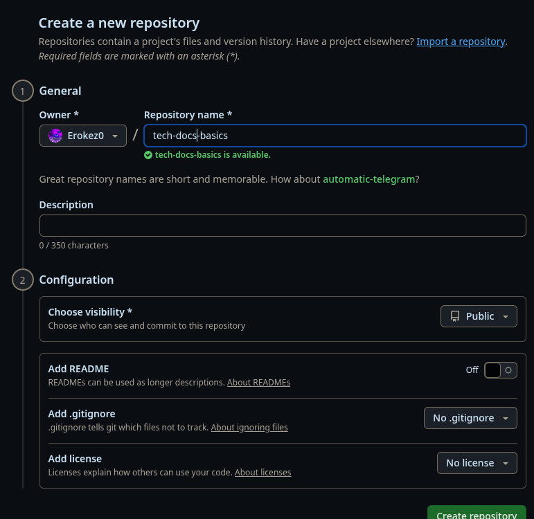

## Шапка

Паршин Кирилл Александрович 

ИТ11.24.1

ParshinKA23@spb.ithub.ru

## Требования перед началом

- Установить git
- При необходимости зарегистрироваться и/или войти в свой аккаунт на сайте [github](http://github.com)

## Создание репозитория

1. Зайти на сайт [github](http://github.com)
2. Нажать в навигационной панели на кнопку **Create new**

    
  
3. Нажать на кнопку **New repository**

    
4. Заполнить название в форме

    

5. Через терминал создать локальную папку и зайти в неё
    ```sh
    mkdir tech-docs-basics
    cd tech-docs-basics
    ```
6. Через терминал создать README.md, заполнить любым удобным образом
    ```sh
    touch README.md
    ```
7. Скопировать и выполнить последние 5 строк скрипта из инструкции github по созданию нового репозитория
    
    ```sh
    git init
    git add README.md
    git commit -m "first commit"
    git branch -M main
    git remote add origin https://github.com/Erokez0/tech-docs-basics.git
    git push -u origin main
    ```
    **Готово!**

## Клонирование

1. Скопировать ссылку на репозиторий и использовать вместе с git clone
    ```sh
    git clone https://github.com/Erokez0/tech-docs-basics
    ```

    **Готово!**

## Добавление изменений

1. Добавить все необходимые файлы в коммит
    ```sh
    git add .
    ```
2. Создать коммит с сообщением
    ```sh
    git commit -m "Сообщение коммита"
    ```
3. Отправить изменения
    ```sh
    git push
    ```

    **Готово!**
